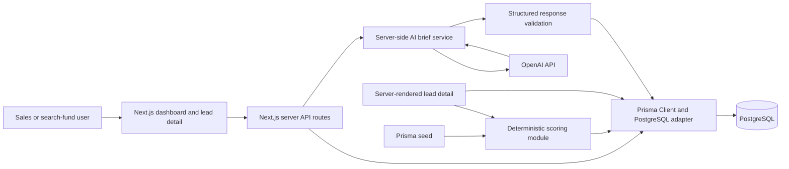

# SaaSquatch Lead Intelligence

## 1. Overview

SaaSquatch Lead Intelligence is a full-stack B2B lead qualification prototype for
sales and search-fund teams. It focuses on the decision that follows lead
discovery: which companies merit attention, what evidence supports that
priority, and what should the team do next?

The dashboard combines transparent, deterministic opportunity scoring with
company and contact data, quality indicators, and an optional AI-generated lead
brief. Users can search and filter leads, compare their qualification signals,
inspect score explanations, and export the selected records.

## 2. Problem

Lead generation produces lists of companies, contacts, and enrichment fields.
Sales teams still need to decide which leads deserve attention. Without a
consistent qualification method, that decision can require manual review,
obscure why one lead ranks above another, and overlook important data gaps.

## 3. Solution

- **Opportunity Score:** A deterministic 0–100 score based on eight
  configurable factors. Each factor has a maximum, earned points, and an
  explanation. An LLM does not set or change the score.
- **AI Lead Brief:** An optional, server-generated summary of why a lead may be
  worth attention, its strongest supplied signals, risks and data gaps, and
  proposed outreach and next steps. It is analysis, not verified company fact.
- **Data Quality:** A separate score reflects evidence completeness and
  contact verification. The dashboard also offers a practical “complete and
  verified” / “needs review” filter.

## 4. Why This Feature

SaaSquatch Leads already supports capabilities such as lead discovery,
enrichment, company insights, revenue estimates, filtering, and export. Lead
Intelligence extends that workflow rather than duplicating it: the gap it
addresses is prioritization and actionable decision support. It makes the
available evidence easier to compare and gives users a reasoned starting point
for their next action.

## 5. Product Workflow

**Discovery → Qualification → Scoring → Prioritization → AI Brief → Action**

The prototype starts with a database of leads ready to qualify. Scoring and
filtering help prioritize them; opening a lead reveals the evidence and score
breakdown. A user can optionally request an AI brief, then choose an action
outside the prototype.

## 6. Architecture



## 7. Tech Stack

- **Application:** Next.js 16.3.8 App Router, React 19.2.8, TypeScript 5
- **Styling:** Tailwind CSS 4 and project CSS
- **Database:** PostgreSQL
- **Data access:** Prisma 7.10 with `@prisma/adapter-pg` and `pg`
- **AI:** Official OpenAI JavaScript SDK (`openai`); configured model defaults
  to `gpt-4o-mini`
- **Quality tools:** ESLint 9, TypeScript, Node.js test runner, and `tsx`
- **Deployment target:** Vercel with a reachable PostgreSQL database

Recharts is not used: the compact dashboard analytics are more clearly shown
with simple, accessible progress bars.

## 8. Database Design

The PostgreSQL `Lead` model in `prisma/schema.prisma` keeps common business
fields typed and queryable:

- Company identity, industry, employee count, revenue and currency, location,
  and technology/business signals
- Contact name, title, email, phone, LinkedIn URL, and verification flags
- Data source, last-updated time, opportunity score, priority tier, and
  score-reason strings
- AI brief fields and generation timestamp
- Created and updated timestamps

Revenue uses `Decimal`; arrays are used for technologies, score reasons, and
AI signal lists. Nullable columns represent unavailable information instead
of encoding every field in arbitrary JSON. Indexes support common company,
industry, size, revenue, location, score, tier, freshness, and contact queries.

## 9. Scoring Algorithm

The scoring engine in `src/lib/scoring/` applies these default weights:

| Factor | Weight |
| --- | ---: |
| Industry fit | 20 |
| Company size fit | 15 |
| Revenue fit | 15 |
| Growth signals (hiring, growth, funding) | 15 |
| Technology fit | 10 |
| Location fit | 10 |
| Contact completeness | 10 |
| Data quality | 5 |
| **Total** | **100** |

Factor weights, target criteria, neutral treatment of missing data, and tier
thresholds are held centrally in `src/lib/scoring/config.ts`. The default tiers
are **High** (80–100), **Medium** (60–79), and **Low** (0–59). Each score is
reproducible from the same lead data and configuration, and the detail view
shows points and the reason for every factor.

The framework is deterministic and configurable, allowing the business to
adapt qualification criteria without changing the UI. Weight changes should
continue to total 100 to retain the 0–100 score scale.

## 10. AI Architecture

AI brief generation is optional and runs through
`POST /api/ai/leads/[id]/brief`; the OpenAI request is server-side only.
Structured company information, available signal fields, and the deterministic
score/reasons are supplied. Personal contact identifiers such as email and
phone values are not sent; only their presence and verification status are
included.

The model is asked for a summary, why the lead may be valuable, strongest
signals, potential risks, a proposed outreach angle, and a recommended next
action. The response uses strict JSON Schema output and is validated on the
server before it is returned or stored. A 15-second timeout and user-facing
error responses cover configuration, provider, and invalid-response failures.

The prompt instructs the model not to invent facts, figures, contacts, funding,
technology, hiring, or events; to call missing fields unavailable; and to
label conclusions as analysis. These safeguards reduce hallucination risk but
do not guarantee that model output is correct—users should verify it.
Validated results and their generation time are stored on the lead and reused
on later requests unless refreshed.

## 11. Data Quality

**Opportunity quality** estimates fit with the configured target profile:
industry, size, revenue, growth, technology, and location. **Data quality**
estimates how complete and verifiable the record is. A strong opportunity
score does not mean its data is complete, and a complete record is not
necessarily a good opportunity.

The dashboard’s “complete and verified” filter is a practical completeness
rule (key company/contact fields, known revenue currency, and verified email);
it is not the same thing as the weighted data-quality score.

## 12. Performance

- PostgreSQL indexes support frequently filtered and sorted fields.
- Lead results are paginated (25 by default, 50 maximum); CSV export is bounded
  at 10,000 rows.
- Filtering, counts, sorting, and analytics use database queries. The compact
  analytics aggregate scoring reasons across the database, not only the
  visible page.
- The detail page computes score explanations server-side; database operations
  and AI calls also remain on the server.
- A complete AI brief is reused rather than regenerated on every page view.

## 13. Security

- Set `DATABASE_URL`, `OPENAI_API_KEY`, and optionally `OPENAI_MODEL` in the
  server environment; never place secrets in client code.
- The OpenAI key is read only by the server route and is not returned to the
  browser.
- API query parameters are validated and bounded; AI output is schema- and
  content-validated before storage.
- `.env` is intended to remain local and must not be committed. Do not use
  production credentials in this demo.

## 14. Deployment

The app is designed for **Vercel** with a PostgreSQL database accessible from
the deployment environment. Configure `DATABASE_URL` and, if AI briefs are
enabled, `OPENAI_API_KEY` and optionally `OPENAI_MODEL` as server-side
environment variables for each environment. Apply committed Prisma migrations
to the target database with `npx prisma migrate deploy`, then build and deploy
the Next.js application. Verify database connectivity and environment
configuration before enabling traffic.

No Vercel deployment or production database provisioning is included in this
repository.

## 15. Local Setup

Requirements: Node.js compatible with the project (Node 24 was used during
development), npm, and a running PostgreSQL database.

In PowerShell:

```powershell
npm install
Copy-Item .env.example .env
```

Edit `.env` and set `DATABASE_URL` to your PostgreSQL connection string. Add
`OPENAI_API_KEY` only if you want to generate AI briefs; a key with available
API access is required, and the default model is `gpt-4o-mini`.

Then run:

```powershell
npm run db:validate
npm run db:migrate
npm run db:seed
npm run dev
```

Open [http://localhost:3000](http://localhost:3000). The seed command inserts
500 deterministic, synthetic leads. Do not run the demo seed against a
database containing records you need to preserve.

## 16. Testing

```powershell
npm test
npm run lint
npm run build
```

`npm test` runs the scoring and AI brief-validation unit tests, including
priority boundaries, missing and negative signals, deterministic results, and
structured brief validation. Lint checks the project with ESLint; build runs
the production Next.js compile and TypeScript checks. The unit suite does not
make billable OpenAI calls.

## 17. Design Decisions

- A deterministic scoring engine keeps numeric prioritization reproducible and
  explainable; the LLM provides optional qualitative analysis only.
- Missing fields receive neutral partial credit rather than being treated
  automatically as negative evidence.
- Business fields are relational and typed; arrays are reserved for naturally
  multi-valued lists rather than an opaque lead JSON document.
- Database-backed server filtering and pagination keep the UI bounded and
  responsive. Simple bars communicate the small analytics set without a chart
  dependency.
- AI output is optional, validated, and cached to reduce unnecessary calls.

## 18. Limitations

- Seeded records are synthetic; the app does not connect to a live lead
  discovery or enrichment provider.
- Scoring criteria and weights are configured in source code; there is no
  per-user scoring editor or profile management UI.
- AI briefs depend on OpenAI credentials, model availability, and account
  access. No live AI call is required to run the rest of the application.
- The AI brief is an assistive interpretation of stored fields, not external
  research, verified advice, or a substitute for human review.
- Authentication, CRM write-back, background jobs, and production observability
  are not implemented.

## 19. Future Improvements

- Integrate live enrichment and source freshness checks.
- Add background processing for large-scale enrichment and brief generation.
- Support CRM integrations and controlled write-back.
- Add business-managed customizable scoring profiles.
- Add production monitoring, tracing, and operational alerts.
- Improve field-level validation, deduplication, and provenance tracking.

## 20. Synthetic Data Notice

All records created by the included seed are synthetic and intended for
demonstration only. Contact names, phone numbers, email addresses, and domains
are fictional; seeded email addresses and domains use reserved `.example`
names. They do not represent real people or companies.

## 21. AI Usage Disclosure

AI is used only when a user requests a lead brief. It interprets structured
lead information and proposes a next action; its response is validated and
stored server-side. AI does **not** calculate or modify opportunity scores,
discover leads, enrich records, verify contacts, or independently establish
company facts. Numeric scores and explanations are generated deterministically
from the configured scoring rules and database fields.
